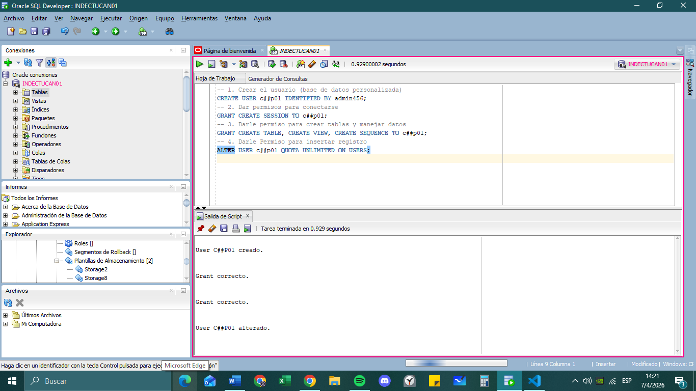
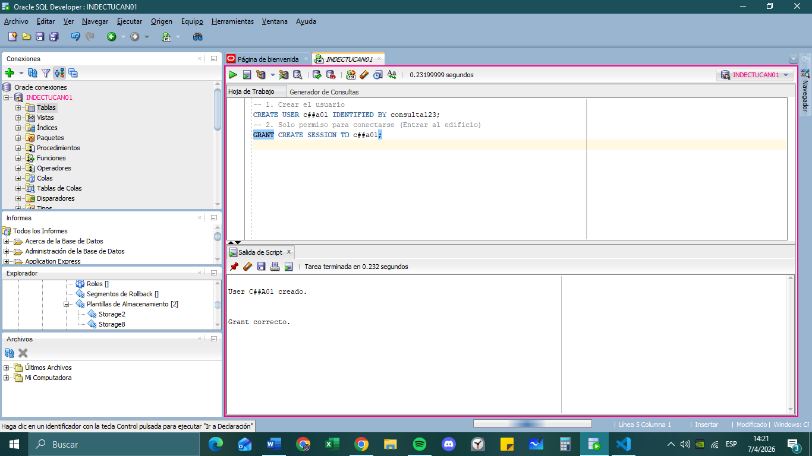
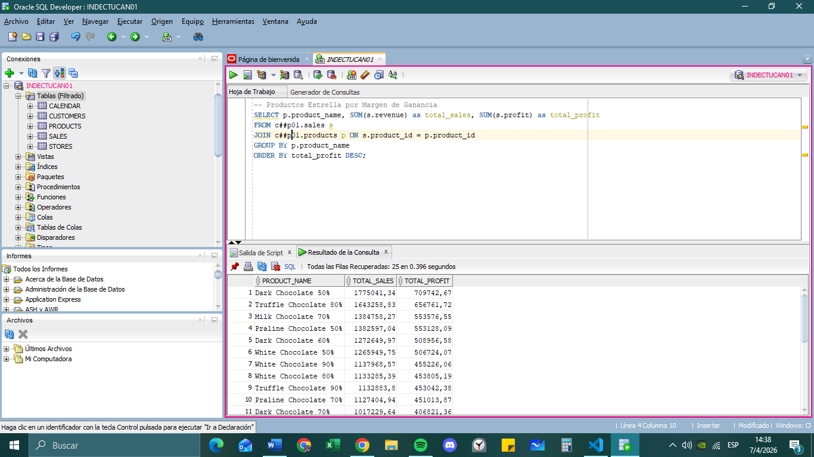
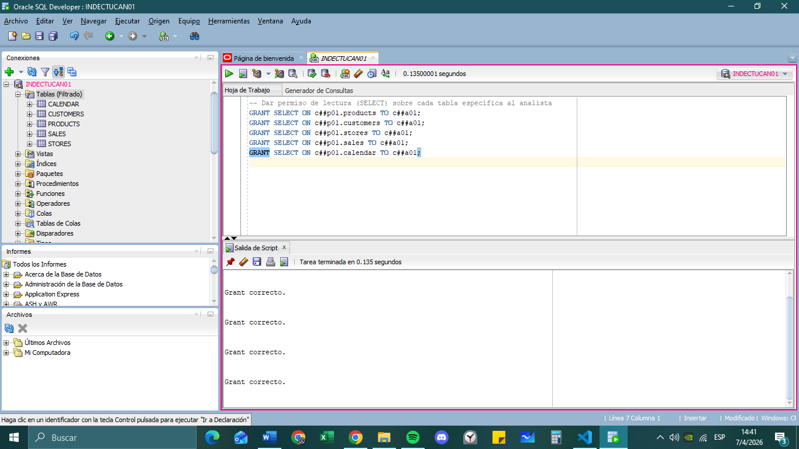
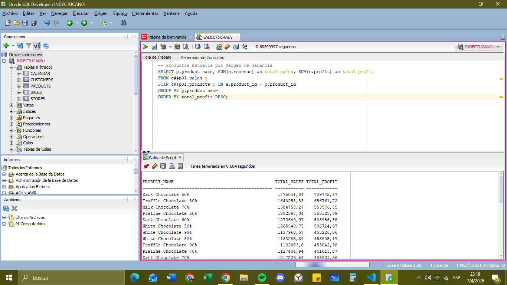
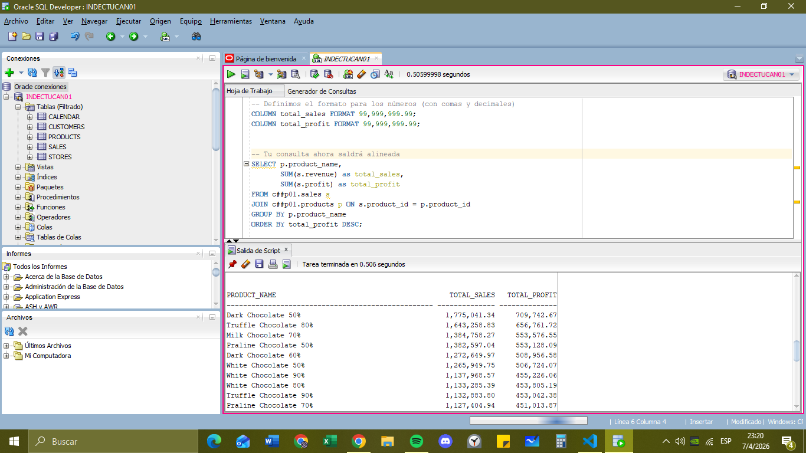
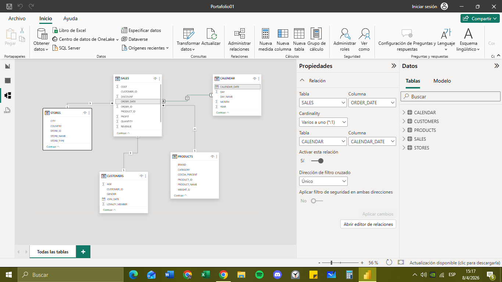
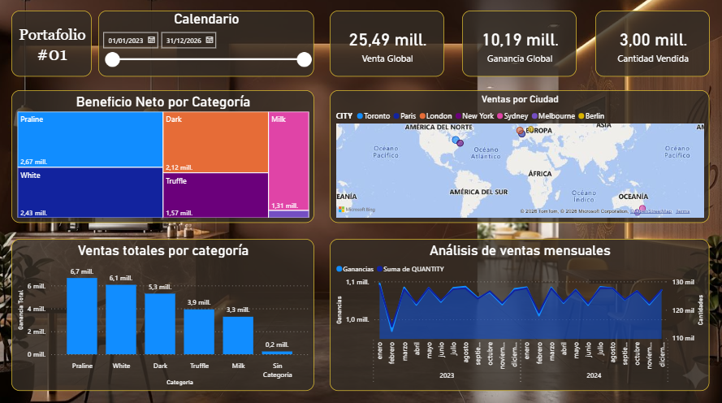

# **Portafolio-01**
**End-to-End Data Pipeline:** Migración de CSV a Oracle SQL mediante un motor ETL en Python. Resuelve integridad referencial con Data Patching (Pandas) y asegura la calidad con validación Regex. Dashboard en Power BI con KPIs estratégicos y storytelling de impacto para retail de chocolates.

# **Proyecto:*** End-to-End Data Pipeline & Retail Analytics
**Tech Stack:** Visual Studio Code | Python | Oracle SQL | Power BI | Data Storytelling 

## **Visión General**
Este proyecto simula un escenario real de una empresa de consumo masivo (chocolates) que necesita migrar su operación de archivos planos (CSV) a un ecosistema de datos robusto. El objetivo no es solo la migración, sino la creación de una "Single Source of Truth" (Fuente Única de Verdad) que permita pasar del caos de los datos aislados a la toma de decisiones estratégicas.

**Link de los archivos CSV:** https://www.kaggle.com/datasets/ssssws/chocolate-sales-dataset-2023-2024

## **Arquitectura de la Solución**
La solución se basa en un flujo de datos integral (End-to-End) diseñado para transformar la facturación operativa en inteligencia de negocios.

1. Extracción y Automatización (Capa de Ingesta - Python)
Para resolver la migración de la empresa retail, se desarrolló un motor ETL (Extract, Transform, Load) en Python que actúa como puente de confianza:
Automatización: Scripts personalizados para la limpieza de datos aislados.
Integridad: Validación de reglas de negocio y limpieza de nulos antes de la carga.
Carga: Ingesta optimizada hacia el motor Oracle SQL.

3. Almacenamiento y Modelado (Capa de Datos - Oracle SQL)
Los datos se estructuran bajo un modelo Star Schema (Esquema Estrella) en un entorno Oracle XE, garantizando máximo rendimiento:
Tabla de Hechos: SALES (Núcleo de la operación con +50,000 registros).
Tablas de Dimensiones: CUSTOMERS, PRODUCTS, STORES y CALENDAR.
Optimización: Uso de llaves primarias y foráneas para garantizar la integridad referencial.

4. Visualización y Estrategia (Capa de Analítica - Power BI)
El destino final es la toma de decisiones mediante Data Storytelling:
Dashboards Interactivos: Seguimiento de ventas en tiempo real por región y producto.
KPIs Críticos: Monitoreo de Ticket Promedio, Tasa de Retención de Clientes y Crecimiento Mensual.
Análisis Predictivo: Identificación de tendencias de consumo estacionales (chocolate en festividades).

5. Flujo de Transformación de IDs
Para garantizar un modelo relacional eficiente en Oracle, el script de Python realiza una limpieza profunda de los identificadores alfanuméricos, convirtiendo datos "sucios" en claves primarias numéricas optimizadas.

| Entidad | Dato Original (CSV/Excel) | Proceso de Limpieza (Regex/Pandas) | Almacenamiento Final (Oracle) |
| :--- | :--- | :--- | :--- |
| **Producto** | `P0080` | `re.sub(r'\D', '', val)` | `80 (NUMBER)` |
| **Cliente** | `C040749` | `re.sub(r'\D', '', val)` | `40749 (NUMBER)` |
| **Tienda** | `S093` | `re.sub(r'\D', '', val)` | `93 (NUMBER)` |
| **Orden** | `0RD00000001` | `re.sub(r'\D', '', val)` | `1 (NUMBER)` |
| **Fechas** | `2023-01-07` | `pd.to_datetime(val)` | `07/01/2023 (DATE)` |

## **Desafío Técnico: El Problema de los "Datos Huérfanos"**
Durante la fase de EDA (Exploratory Data Analysis) en Python, se detectó una vulnerabilidad crítica: la tabla de ventas contenía transacciones de productos (P0000, P0201) que no figuraban en el catálogo maestro. Cargar estos datos directamente en Oracle habría provocado un fallo por violación de Integridad Referencial (Foreign Keys).
Mi Solución: Auditoría Dinámica e Inyección de Datos de Rescate
No opté por eliminar los registros (lo cual alteraría los reportes financieros), sino por una estrategia de curación de datos en tres etapas:

1. Detección y Auditoría con Pandas
Utilicé un left merge con indicadores para realizar una auditoría cruzada entre la tabla de hechos y las dimensiones.

2. Normalización de Emergencia (Data Patching)
En lugar de permitir el error, el script de Python genera automáticamente "registros de recuperación" para los IDs faltantes. Esto asegura que la base de datos empresarial reciba información coherente, etiquetando estos productos como "Chocolate Recuperado".
Acción: Se concatenaron los nuevos registros con valores por defecto (Sin Categoría, 0% cocoa) para no detener el flujo de ingesta.
Resultado: La dimensión de productos pasó de tener huecos informativos a una cobertura del 100%.

3. Validación de Integridad Pre-Carga
Desarrollé una función de auditoría integral (check_integrity) que actúa como un "Gatekeeper" (guardián). Antes de tocar el motor Oracle SQL, el script verifica todas las llaves foráneas (product_id, customer_id, store_id).

## **Estrategia de Seguridad: Control de Acceso Granular**
En lugar de trabajar con un usuario con superpoderes (como SYSTEM o SYS), la solución implementa un modelo de Segregación de Funciones (SoD) y el Principio de Menor Privilegio.

1. El Esquema Propietario (c##portafolio01 = c##p01)
Este es el "Arquitecto" y "Dueño" de los datos. Es el usuario que utiliza el script de Python para el proceso ETL.
Responsabilidad: Crear la estructura (DDL) y cargar los datos limpios (DML).
Permisos clave: CREATE TABLE, UNLIMITED QUOTA en el Tablespace.

3. El Esquema de Consulta (c##analista01 = c##a01)
Este es el "Usuario Final" o la cuenta que conectaría herramientas como Power BI o Excel.
Responsabilidad: Consumo de información y generación de reportes.
Restricción de Seguridad: Solo tiene permisos de SELECT. No puede borrar datos, modificar precios ni alterar la estructura de las tablas, protegiendo la integridad de la base de datos.

## **Data Integrity & Relational Architecture (Arquitectura Relacional e Integridad de Datos)**
Para garantizar que el ecosistema de datos sea confiable (Single Source of Truth), implementé una arquitectura relacional estricta en Oracle SQL. A continuación, demuestro la integridad del modelo mediante consultas de auditoría:

1. Validación de la Dimensión de Tiempo (Continuidad del Calendario)
Esta consulta verifica que nuestra tabla calendar cubra perfectamente el rango de fechas de la tabla de hechos, asegurando que no existan ventas "en el vacío" temporal.
-- Comprobar que no existan fechas de ventas fuera del catálogo maestro de tiempo
SELECT COUNT(*) AS Ventas_Sin_Fecha
FROM c##p01.sales s
LEFT JOIN c##p01.calendar c ON s.order_date = c.calendar_date
WHERE c.calendar_date IS NULL;

2. Productos Estrella por Margen de Ganancia
-- Definimos el formato para los números (con comas y decimales)
COLUMN total_sales FORMAT 99,999,999.99;
COLUMN total_profit FORMAT 99,999,999.99;
-- Tu consulta ahora saldrá alineada
SELECT p.product_name, 
       SUM(s.revenue) as total_sales, 
       SUM(s.profit) as total_profit
FROM c##p01.sales s
JOIN c##p01.products p ON s.product_id = p.product_id
GROUP BY p.product_name
ORDER BY total_profit DESC;

## **De los Datos al Storytelling (Business Impact)**
El proyecto culmina en Power BI, donde los datos se transforman en una narrativa accionable para el negocio:
Referencias al Tablero de Power BI:

1. Categoría "Sin Categoría": En tu gráfico de "Ventas totales por categoría", aparece una barra pequeña de 0,2 mill. etiquetada como "Sin Categoría". Esto demuestra visualmente el éxito de tu estrategia de "registros de recuperación" (Data Patching) que programaste en Python.

2. KPIs de Negocio: Podés documentar que el tablero ya refleja métricas reales:
Venta Global: 25,49 mill.
Ganancia Global: 10,19 mill.
Volumen: 3,00 mill. de unidades vendidas.

3. Análisis Geográfico: El mapa confirma que tu limpieza de la tabla STORES permitió ubicar correctamente las ventas en ciudades como Toronto, París, Londres y Sydney.

